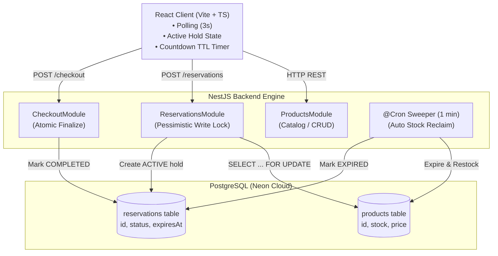
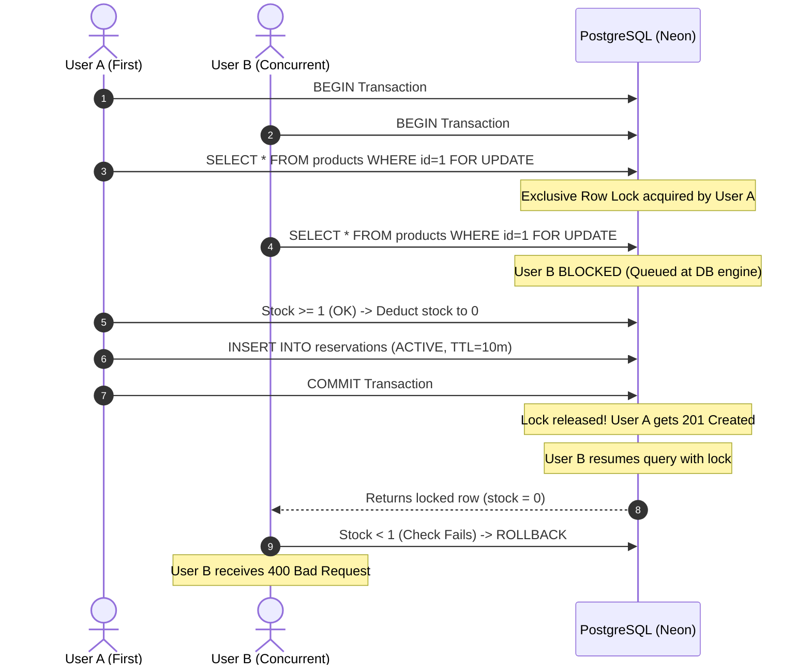

# Limited Drop — High-Concurrency Flash Reservation Engine

A production-grade, full-stack flash sale reservation platform engineered to handle high-demand product drops with strict transactional integrity. The system eliminates race conditions and overselling vulnerabilities through row-level pessimistic database locks, state-machine-driven holds, and automated inventory reclamation.

---

## 1. System Architecture

The application separates concerns between a reactive client and a modular, transactional backend:



---

## 2. Concurrency Strategy & Race Condition Defense

### The Critical Vulnerability
In standard inventory systems, inventory checks execute in application memory:

```typescript
// VULNERABLE PATTERN
const product = await productRepository.findOne(id);
if (product.stock >= quantity) {
  product.stock -= quantity;
  await productRepository.save(product);
}
```

If 20 concurrent requests execute when `stock = 1`, all 20 threads read `stock = 1` before any write commits. Every transaction decrements stock, driving inventory to negative values (`-19`) and selling phantom stock.

### The Defense: Pessimistic Row Locking (`SELECT ... FOR UPDATE`)
This system enforces serialized execution at the database engine level using explicit TypeORM `QueryRunner` transactions:

```typescript
const queryRunner = this.dataSource.createQueryRunner();
await queryRunner.connect();
await queryRunner.startTransaction();

try {
  // Acquires an exclusive row-level lock on the product record
  const product = await queryRunner.manager.findOne(Product, {
    where: { id: dto.productId },
    lock: { mode: 'pessimistic_write' },
  });

  if (!product || product.stock < dto.quantity) {
    throw new BadRequestException('Not enough stock available');
  }

  product.stock -= dto.quantity;
  await queryRunner.manager.save(Product, product);

  const expiresAt = new Date(Date.now() + 10 * 60 * 1000); // 10-minute hold
  const reservation = queryRunner.manager.create(Reservation, {
    productId: product.id,
    quantity: dto.quantity,
    status: ReservationStatus.ACTIVE,
    expiresAt,
  });

  await queryRunner.manager.save(Reservation, reservation);
  await queryRunner.commitTransaction();
} catch (err) {
  await queryRunner.rollbackTransaction();
  throw err;
} finally {
  await queryRunner.release();
}
```



---

## 3. Reservation State Machine & Auto-Reclamation

Reservations follow a strict, non-reversible lifecycle:
* **ACTIVE:** Stock is decremented immediately upon reservation; held for a 10-minute TTL window.
* **COMPLETED:** User successfully checks out; status transitions to permanent completion.
* **EXPIRED:** If 10 minutes elapse without checkout, a background worker sweeps the record.

### Automated Background Sweeper (`@Cron`)
To prevent abandoned carts from permanently locking inventory, a NestJS scheduled task executes every 60 seconds (`@Cron(CronExpression.EVERY_MINUTE)`):
1. Queries all `ACTIVE` reservations where `expiresAt < NOW()`.
2. Transitions their status to `EXPIRED`.
3. Atomically restores the held quantity back to `products.stock` via SQL increment:
   `UPDATE products SET stock = stock + quantity WHERE id = productId`

---

## 4. Architectural Decisions & Rationale

* **Pessimistic Row-Level Locking (`SELECT FOR UPDATE`):** Flash sales present concentrated, high-contention spikes on identical database records. Optimistic locking with version columns fails under extreme bursts because nearly all concurrent transactions abort and require expensive application retries. Pessimistic locking serializes requests cleanly in database engine queues.
* **Explicit ACID Transactions (`QueryRunner`):** High-level ORM patterns obscure transaction boundaries. Using explicit `QueryRunner` start/commit/rollback blocks ensures inventory deductions and reservation holds succeed atomically or fail completely.
* **Modular Domain Separation:** NestJS modules (`Products`, `Reservations`, `Checkout`) isolate inventory tracking, hold generation, and purchase finalization into distinct layers.

---

## 5. Assumptions Made

* **10-Minute Hold Window:** A 10-minute TTL gives purchasers adequate time to complete checkout while keeping abandoned items from lingering out of circulation.
* **Single-Unit Drop Focus:** Although the schema and service support arbitrary quantities, drops are modeled as single-item purchases to match limited-drop mechanics.
* **Stateless Polling (3s):** The frontend relies on clean HTTP polling every 3 seconds, assuming users may have unstable mobile network connections where long-lived WebSockets risk dropped socket states.

---

## 6. Trade-offs Considered

| Choice Made | Alternative Considered | Trade-off / Rationale |
| :--- | :--- | :--- |
| **Pessimistic Write Locking** | Optimistic Locking (`@VersionColumn`) | Optimistic locking causes massive abort rates under high contention spikes. Pessimistic locking holds the row lock briefly (~5-10ms) but ensures predictable FIFO throughput. |
| **PostgreSQL Scheduled `@Cron` Sweeper** | Redis TTL Key Expiration | Avoids introducing an external Redis cluster and dual-write synchrony issues, keeping single-source-of-truth state inside PostgreSQL. |
| **Client Polling (3s Interval)** | WebSockets / SSE | Eliminates stateful socket connection management and connection limits on serverless cloud platforms (Vercel/Render). |

---

## 7. What I Would Improve With More Time

* **Redis + Lua Token Bucket Layer:** Introduce a Redis atomic decrement step in front of the database to handle tens of thousands of requests per second before hitting PostgreSQL.
* **Asynchronous Queue for Finalization (BullMQ):** Move final checkout and payment webhook processing onto an asynchronous queue to isolate payment gateway latency.
* **Idempotency Keys:** Require a client-generated UUID on reservation endpoints to prevent duplicate submissions from erratic network double-taps.
* **End-to-End CI Pipeline:** Configure GitHub Actions to execute automated migration checks, linting, and concurrency stress scripts in a disposable Dockerized PostgreSQL service.

---

## 8. API Reference

* `GET /products` — Retrieve all active product drops and stock counts.
* `GET /products/:id` — Retrieve a single product.
* `POST /products` — Create a product drop.
* `POST /reservations` — Atomically acquire a 10-minute hold (`{ "productId": 1, "quantity": 1 }`).
* `GET /reservations/:id` — Retrieve hold status and expiration timestamp.
* `POST /checkout/:reservationId` — Finalize purchase and mark reservation `COMPLETED`.

---

## 9. Local Setup & Testing

### Prerequisites
* Node.js >= 18.x
* PostgreSQL (Local or Cloud like Neon)

```bash
# 1. Clone repository
git clone https://github.com/MohamedYerrou/limited-drop.git
cd limited-drop

# 2. Configure Backend
npm install
cp .env.example .env # Add DATABASE_URL

# 3. Start Backend
npm run start:dev

# 4. Start Frontend
cd frontend
npm install
npm run dev

# 5. Run Concurrency Stress Verification (from root)
node test-concurrency.js
```